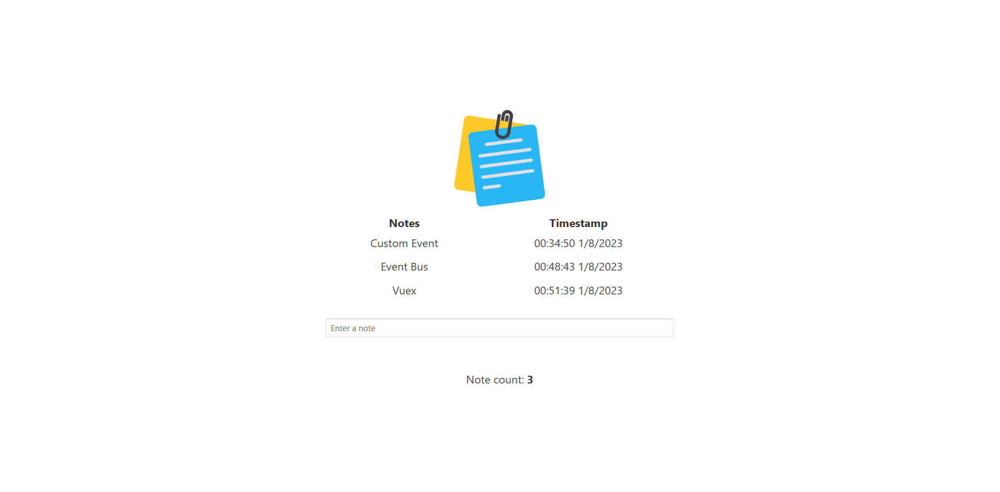

<a name="readme-top"></a>
<!-- TABLE OF CONTENTS -->
<details>
  <summary>Table of Contents</summary>
  <ol>
    <li>
      <a href="#about-the-project">About The Project</a>
      <ul>
        <li><a href="#built-with">Built With</a></li>
      </ul>
    </li>
    <li>
      <a href="#getting-started">Getting Started</a>
      <ul>
        <li><a href="#prerequisites">Prerequisites</a></li>
        <li><a href="#installation">Installation</a></li>
      </ul>
    </li>
    <li><a href="#key-features">Key Features</li>
    <li><a href="#usage">Usage</a></li>
    <li><a href="#contact">Contact</a></li>
  </ol>
</details>

<p align="center">
    
</p>

# About The Project
A very simple note-taking application to know how to manage information between multiple components in Vue. It's based on chapter 4 and 5 of the book "<b><i>Fullstack Vue 3</i></b>".

## Built With
* [![HTML5][HTML5-shield]][HTML5-url]
* [![CSS3][CSS3-shield]][CSS3-url]
* [![JavaScript][JavaScript-shield]][JavaScript-url]
* [![Vue.js][Vue.js-shield]][Vue.js-url]
* [![Bulma][Bulma-shield]][Bulma-url]

<p align="right">(<a href="#readme-top">back to top</a>)</p>

# Getting Started

## Prerequisites
Before cloning and using this application, you'll need to install these things on your computer:
* [Visual Studio Code](https://code.visualstudio.com/download): You can choose any IDE or Text Editor that you want. To build a simple application like this, I recommend <b>Visual Studio Code</b>.
* [Live Server](https://marketplace.visualstudio.com/items?itemName=ritwickdey.LiveServer): An extension for Visual Studio Code that help to launch a local development server with live reload feature for static & dynamic pages.

## Installation
You can install this application by cloning this repository into your current working directory:
```sh
git clone https://github.com/theEmperorofDaiViet/note-taking.git
```
After cloning the repository, you can open the project by Visual Studio Code.

Click to <code>Go Live</code> from the status bar to turn the server on/off.

As usual, the app should automatically open in a new tab in your browser. It runs on port 5500 by default.

<p align="right">(<a href="#readme-top">back to top</a>)</p>

# Key Features
Our note-taking app will have a simple input field that allows a user to enter notes. When the user types information and presses the Enter key, the user input should be displayed in the Notes column and the timestamp of that submission should be seen in the Timestamp column. Since <code>v2.0.0</code>, our app also displays the number of notes a user has entered.

We will use different ways of managing data between components:
- <code>v1.0.0</code>: using Custom Event
- <code>v2.0.0</code>: implement an Event Bus by [mitt](https://www.npmjs.com/package/mitt) - an external event emitter library
- <code>v2.0.0</code>: using Vuex

<p align="right">(<a href="#readme-top">back to top</a>)</p>

# Usage
Our app looks like this:

<p align="center">
    
</p>

<p align="right">(<a href="#readme-top">back to top</a>)</p>

# Contact

You can contact me via:
* [![GitHub][GitHub-shield]][GitHub-url]
* [![LinkedIn][LinkedIn-shield]][LinkedIn-url]
* ![Gmail][Gmail-shield]:&nbsp;<i>Khiet.To.05012001@gmail.com</i>
* [![Facebook][Facebook-shield]][Facebook-url]
* [![Twitter][Twitter-shield]][Twitter-url]

<br/>
<p align="right">(<a href="#readme-top">back to top</a>)</p>

<!-- MARKDOWN LINKS & IMAGES -->
<!-- Tech stack -->
[HTML5-shield]: https://img.shields.io/badge/html5-%23E34F26.svg?style=for-the-badge&logo=html5&logoColor=white
[HTML5-url]: https://www.w3.org/html/
[CSS3-shield]: https://img.shields.io/badge/css3-%231572B6.svg?style=for-the-badge&logo=css3&logoColor=white
[CSS3-url]: https://www.w3.org/Style/CSS/
[JavaScript-shield]: https://img.shields.io/badge/JavaScript-323330?style=for-the-badge&logo=javascript&logoColor=F7DF1E
[JavaScript-url]: https://www.ecma-international.org/
[Vue.js-shield]: https://img.shields.io/badge/vuejs-%2335495e.svg?style=for-the-badge&logo=vuedotjs&logoColor=%234FC08D
[Vue.js-url]: https://vuejs.org/
[Bulma-shield]: https://img.shields.io/badge/Bulma-00D1B2?style=for-the-badge&logo=Bulma&logoColor=white
[Bulma-url]: https://bulma.io/

<!-- Contact -->
[GitHub-shield]: https://img.shields.io/badge/github-%23121011.svg?style=for-the-badge&logo=github&logoColor=white
[GitHub-url]: https://github.com/theEmperorofDaiViet
[LinkedIn-shield]: https://img.shields.io/badge/linkedin-%230077B5.svg?style=for-the-badge&logo=linkedin&logoColor=white
[LinkedIn-url]: https://www.linkedin.com/in/khiet-to/
[Gmail-shield]: https://img.shields.io/badge/Gmail-D14836?style=for-the-badge&logo=gmail&logoColor=white
[Facebook-shield]: https://img.shields.io/badge/Facebook-%231877F2.svg?style=for-the-badge&logo=Facebook&logoColor=white
[Facebook-url]: https://www.facebook.com/Khiet.To.Official/
[Twitter-shield]: https://img.shields.io/badge/Twitter-%231DA1F2.svg?style=for-the-badge&logo=Twitter&logoColor=white
[Twitter-url]: https://twitter.com/KhietTo